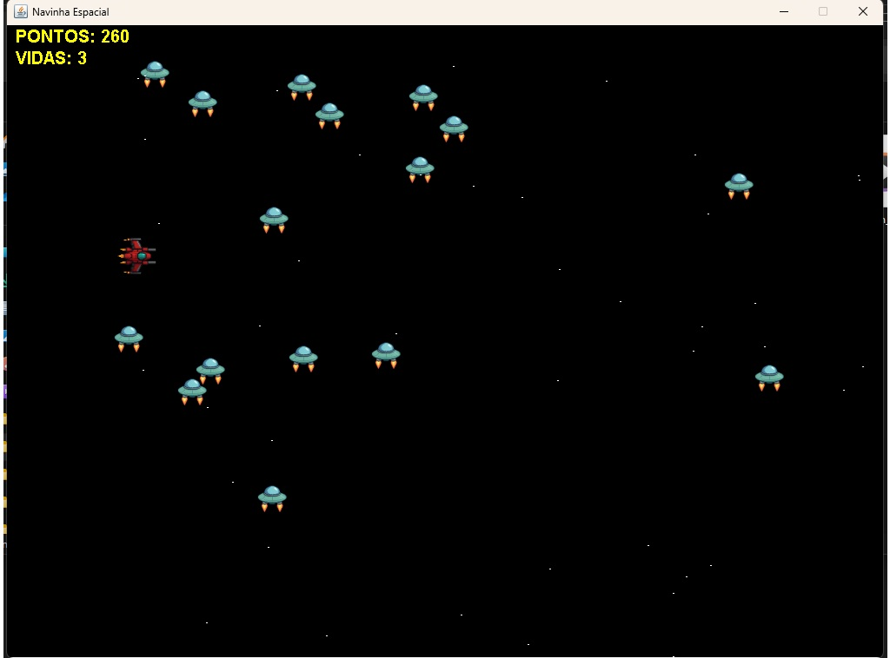

# 🚀 Jogo de Navinha Espacial em Java

Um jogo 2D estilo "navinha" desenvolvido em Java utilizando `JPanel` para gráficos, onde o jogador controla uma nave, atira em inimigos e tenta sobreviver ao maior número possível de colisões!

## 🎮 Funcionalidades

- Controle da nave com teclado (setas direcionais)
- Tiros com colisões nos inimigos
- Inimigos gerados aleatoriamente com movimento automático
- Tela de **Game Over** ao colidir com um inimigo
- Sons (em desenvolvimento)
- Placar e sistema de vidas (em desenvolvimento)

## 📷 Captura de Tela



## 🛠️ Tecnologias Utilizadas

- Java (JDK 8+)
- Swing / AWT (`JPanel`, `Graphics2D`, `Timer`, etc.)
- Orientação a Objetos (OOP)
- Imagens PNG e colisões por `Rectangle`

## 📁 Estrutura do Projeto

```
meu_jogo/
├── res/  
│   ├── background.png 
│   ├── nave.png 
│   ├── inimigo.png 
│   └── GAMEOVER.png
├── src/
│   ├── imagem-jogo.jpg
│   ├── Fase.java
│   ├── Player.java
│   ├── Tiro.java
│   ├── Enemy1.java
│   └── Main.java
```

## ▶️ Como Jogar

1. Compile todos os arquivos `.java`.
2. Execute a classe principal `Main.java`.
3. Use as setas do teclado para mover a nave.
4. Pressione **espaço** para atirar.
5. Evite colisões com os inimigos!
6. Ao perder, a tela de **Game Over** será exibida.

## 🚧 Funcionalidades Futuras

- ✅ Sistema de pontuação
- ✅ Sistema de vidas
- ✅ Tela inicial com botão "Jogar"
- ✅ Sons de tiro e explosão
- ⏳ Salvamento de nome do jogador com pontuação

## 🧠 Autor

**Jamerson Rafael da Silva Viana**  
📧 [jamersonrafael.sv@gmail.com]  
📅 Projeto iniciado em 2025

---

Feito com 💙 em Java.
